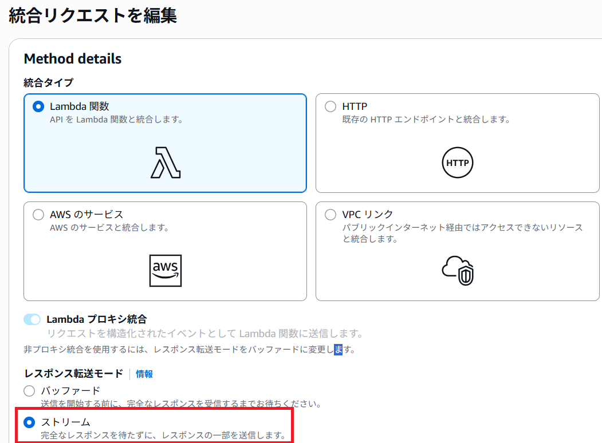

# Amazon API Gateway のレスポンスストリームを試す

## 参考 URL

* [Building responsive APIs with Amazon API Gateway response streaming | AWS Blog](https://aws.amazon.com/jp/blogs/compute/building-responsive-apis-with-amazon-api-gateway-response-streaming/)

---

## 手順

1. SAM テンプレートをデプロイ
1. スタック作成後の出力のコマンドを実行
    - コマンド例
    ```
    $ curl --no-buffer https://jx36ygsmkc.execute-api.us-west-2.amazonaws.com/dev/stream
    ```

    - 出力例
    ```
    {"messageStart":{"p":"abcdefghijkl","role":"assistant"}}
    {"contentBlockDelta":{"contentBlockIndex":0,"delta":{"text":""}}}
    {"contentBlockDelta":{"contentBlockIndex":0,"delta":{"text":"京都は"}}}
    {"contentBlockDelta":{"contentBlockIndex":0,"delta":{"text":"日本"}}}
    {"contentBlockDelta":{"contentBlockIndex":0,"delta":{"text":"の歴史"}}}
    {"contentBlockDelta":{"contentBlockIndex":0,"delta":{"text":"と"}}}
    {"contentBlockDelta":{"contentBlockIndex":0,"delta":{"text":"文化の"}}}
    {"contentBlockDelta":{"contentBlockIndex":0,"delta":{"text":"中心"}}}
    {"contentBlockDelta":{"contentBlockIndex":0,"delta":{"text":"地であり、多くの有"}}}
    {"contentBlockDelta":{"contentBlockIndex":0,"delta":{"text":"名な観光地があります"}}}
    {"contentBlockDelta":{"contentBlockIndex":0,"delta":{"text":"。以下"}}}
    {"contentBlockDelta":{"contentBlockIndex":0,"delta":{"text":"に"}}}
    {"contentBlockDelta":{"contentBlockIndex":0,"delta":{"text":"、"}}}
    {"contentBlockDelta":{"contentBlockIndex":0,"delta":{"text":"京都"}}}
    {"contentBlockDelta":{"contentBlockIndex":0,"delta":{"text":"の有"}}}
    {"contentBlockDelta":{"contentBlockIndex":0,"delta":{"text":"名な観光地を5"}}}
    {"contentBlockDelta":{"contentBlockIndex":0,"delta":{"text":"つ紹介します。\n\n1"}}}
    ```

---

## 参考: AWS マネジメントコンソールでの設定

* [統合リクエスト] で Lambda 関数のプロキシ統合を指定して、[レスポンス転送モード] で [ストリーム] を選択する　

